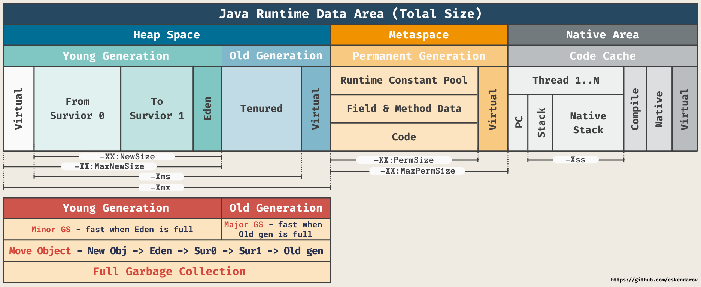
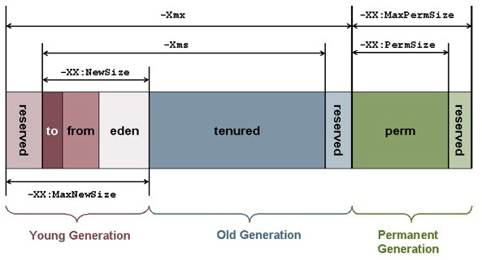
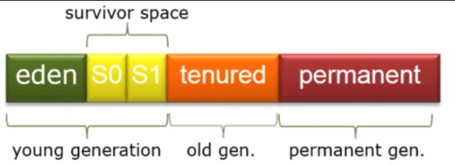
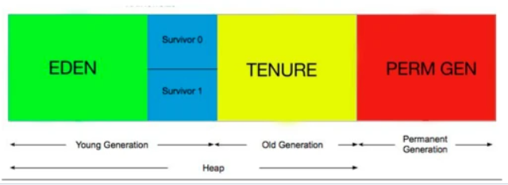
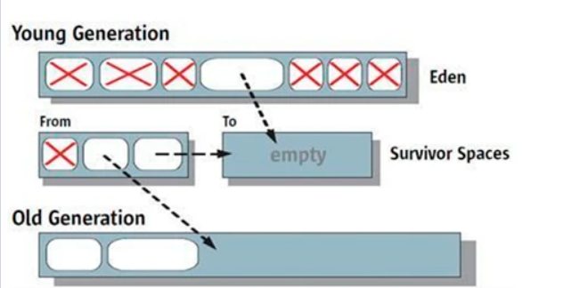
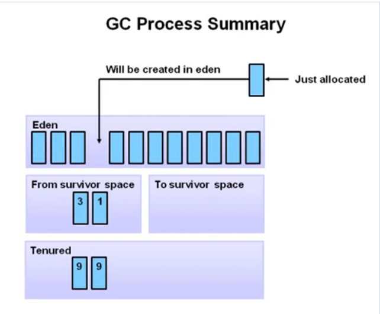

# Сборщик мусора Java. Garbage Collector.
**_Для начала, чтобы понять, как работает сборщик мусора Garbage Collector, необходимо иметь представление о распределении памяти в JVM (Java Virtual Machine)._**

## Распределение памяти в JVM

### Разделение памяти JVM
Память процесса делится на Stack (стек) и Heap (куча) и включает 5 областей:
- **Stack**
    - `Permanent Generation` — используемая JVM память для хранения метаинформации; классы, методы и т.п.
    - `Code Cache` — используемая JVM память при включенной JIT-компиляции; в этой области памяти кешируется скомпилированный платформенно-зависимый код.
- **Heap** (Делится на два поколения: _Young Generation, Old Generation_)
  - `Young Generation:`
    - `Eden Space` — в этой области выделяется память под все создаваемые программой объекты. Жизненный цикл большей части объектов, к которым относятся итераторы, объекты внутри методов и т.п., недолгий.
    - `Survivor Space`  — здесь хранятся перемещенные из Eden Space объекты после первой сборки мусора. Объекты, пережившие несколько сборок мусора, перемещаются в следующую сборку Tenured Generation.
  - `Old Generation:`
    - `Tenured Space` хранит долгоживущие объекты. Когда данная область памяти заполняется, выполняется полная сборка мусора (full, major collection).
  
**JVM Memory Model:**

### Область памяти Permanent Generation
Область памяти Permanent Generation используется виртуальной машиной JVM для хранения необходимых для управления программой данных, в том числе метаданные о созданных объектах.  
При каждом создании объекта JVM будет сохранять некоторый набор данных об объекте в области Permanent Generation. Соответственно, чем больше создается в программе объектов, тем больше требуется «пространства» в Permanent Generation.  
Размер Permanent Generation можно задать двумя параметрами виртуальной машины JVM :
- `-XX:PermSize` – минимальный размер выделяемой памяти для Permanent Generation;
- `-XX:MaxPermSize` – максимальный размер выделяемой памяти для Permanent Generation.

Для «больших» Java-приложений можно при запуске определить одинаковые значения данных параметров, чтобы Permanent Generation была создана с максимальным размером. Это может увеличить производительность, поскольку динамическое изменение размера Permanent Generation является «дорогостоящей» (трудоёмкой) операцией. Определение одинаковых значений этих параметров может избавить JVM от выполнения дополнительных операций, связанных с проверкой необходимости изменения размера Permanent Generation.

### Область памяти Heap
Куча Heap является основным сегментом памяти, где хранятся создаваемые объекты. Heap делится на два подсегмента: Tenured (Old) Generation и New Generation. New Generation в свою очередь делится на Eden Space и Survivor.  
При создании нового объекта, когда используется оператор 'new', например byte[] data = new byte[1024], этот объект создаётся в сегменте Eden Space. Кроме, собственно данных для массива байт, создается также ссылка (указатель) на эти данные.  
Если места в сегменте Eden Space уже нет, то JVM выполняет сборку мусора. При сборке мусора объекты, на которые имеются ссылки, не удаляются, а перемещаются из одной области в другую. Так, объекты со ссылками перемещаются из Eden Space в Survivor Space, а объекты без ссылок удаляются.  
Если количество используемой Eden Space памяти превышает некоторый заданный объем, то Garbage Collection может выполнить быструю (minor collection) сборку мусора. По сравнению с полной сборкой мусора данный процесс занимает немного времени, и затрагивает только область Eden Space — устаревшие объекты без ссылок удаляются, а выжившие перемещаются в область Survivor Space.  
Размер сегмента Heap можно определить двумя параметрами: `-Xms`(минимум) и `-Xmx`(максимум).

**Stack's and Heap's Space Size:**

### В чем отличие между сегментами Stack и Heap?
1) Heap (куча) используется всеми частями приложения, а Stack используется только одним потоком исполнения программы.
2) Новый объект создается в Heap, а в памяти Stack размещается ссылка на него. В памяти стека также размещаются локальные переменные примитивных типов.
3) Объекты в куче доступны из любого места программы, в то время, как стековая память не доступна для других потоков.
4) Если память стека полностью занята, то Java Runtime вызывает исключение `java.lang.StackOverflowError`, а если память кучи заполнена, то вызывается исключение `java.lang.OutOfMemoryError: Java Heap Space`.
5) Размер памяти стека, как правило, намного меньше памяти в куче. Из-за простоты распределения памяти (LIFO), стековая память работает намного быстрее кучи.

## Процесс сборки мусора в Java
Сборка мусора в Java автоматически выделяет и освобождает память, поэтому разработчикам не нужно писать отдельную программу для управления памятью, что является одним из основных преимуществ программирования на Java.  
Каждый раз, когда Java-программа запускается на JVM, объекты создаются в куче (heap) и представляют собой часть памяти, предназначенную для программы. Со временем некоторые предметы больше не понадобятся. Сборщик мусора находит эти неиспользуемые объекты и удаляет их, чтобы освободить память.  
Сборщик мусора, оценив кучу памяти, определит, какие объекты используются, а какие нет, и удалит неиспользуемые объекты. Используемый объект или объект, на который имеется ссылка, означает, что некоторая часть вашей программы все еще поддерживает указатель на этот объект.  
Если объект уже не используется или, на него нет ссылок, то какая-либо часть программы на него больше не будет ссылаться. Таким образом, память используемая объектом, на который нет ссылки, может быть освобождена путем выполнения сборки мусора.

**Stack and Heap Memory:**  

Освобождение памяти можно описать тремя основными процессами:  
1) **Маркировка** — это процесс идентификации частей памяти, которые используются и не используются сборщиком мусора. Обычно маркировка является первым этапом.
2) **Обычное удаление** — процесс удаления объектов не имеющих ссылок, с оставлением в свободном пространстве объектов и указателей, на которые есть ссылки.
3) **Удаление с уплотнением** — помимо удаления объектов не имеющих ссылок, оно сжимает оставшиеся объекты, на которые имеются ссылки, перемещая объекты вместе, чтобы сделать новое выделение памяти намного проще и быстрее.

**JVM Stack and Heap Memory:**

### Young Generation
Вновь созданные объекты начинаются в Young Generation. Его еще называют ясли, так как здесь начинают жить новые объекты. Young Generation подразделяется на Eden Space, где начинаются все новые объекты, и два пространства Survivor, где объекты перемещаются из Eden после сохранения (surviving) в одном цикле сборки мусора. Они вызывают повторную сборку мусора, когда объекты собираются сборщиком мусора из Young Generation.  
- **Eden Space** - Все новые объекты сначала создаются в Eden Space. Незначительный сбор мусора сработает, когда он достигнет порога, определяемого JVM. Упомянутые объекты перемещаются из Eden Space в пространство первого сохранения (‘Eden’ and ‘from’ —> ‘to’). Объекты, на которые нет ссылок, удаляются при очистке Eden Space.
- **Survivor 0 (S0) and Survivor 1 (S1)** - Оба поля survivor (From and to) начинаются пустыми. Когда происходит повторная сборка мусора, все объекты, на которые есть ссылки, перемещаются в оставшееся пространство. Когда сборка мусора закончится, места (имена) survivor «from» и «to» меняются местами. Если во время предыдущей сборки мусора S1 был в роли «to», то теперь S1 заполнен и становится «from». Соответственно, если S0 пусто, то оно станет «to».

### Old Generation
После незначительной сборки мусора, когда устаревшие объекты достигают определенного порога возраста (по умолчанию порог современных JVM установлен на 15 циклов сборки мусора), они вместе с объектами-долгожителями переходят из молодого поколения в старое.  
Поскольку второстепенные сборщики мусора продолжают возникать, объекты продолжают перемещаться в пространство Old Generation, оно начнет заполняться и произойдет основной сбор мусора.  
Основная сборка мусора происходит, когда объекты собираются сборщиком мусора Old Generation.

**The Old and Young Generation Interaction:**

### Permanent Generation
Метаданные, такие как классы и методы, хранятся в Permanent Generation (постоянном поколении). Классы, которые больше не используются, могут быть из него удалены сборщиком мусора. Во время полного сбора мусора неиспользуемые объекты всех поколений собираются.

**GC Process Summary:**

### Типы сборки мусора
Сборки мусора, очищающие различные части внутри кучи, часто называют Minor, Major и Full сборками мусора. Но, поскольку термины Minor, Major и Full широко используются и без надлежащего определения, мы рассмотрим объяснение всех этих типов сборки мусора.  
- **Minor Garbage Collection** - Сборка мусора из пространства Young Generation называется Minor Garbage Collection. Этот тип сборки всегда запускается, когда JVM не может выделить место для нового объекта, то есть когда Eden Space заполняется. Таким образом, чем выше скорость выделения, тем чаще происходит Minor Garbage Collection.
- **Major Garbage Collection** - Major Garbage Collection очищает Tenured (старое пространство). Поскольку Old Generation больше по размеру, сборка происходит реже, чем у Young Generation. Когда объекты исчезают из Old Generation, мы говорим, что произошел «большая сборка мусора». Сборщик Old Generation попытается предугадать, когда ему нужно начать сборку, чтобы избежать неудач в продвижении со стороны Young Generation.

Сборщики отслеживают порог заполнения для Old Generation и начинают сборку, когда этот порог превышен. Если этого порога недостаточно для удовлетворения требований продвижения, запускается «Full Garbage Collection».  
- **Full Garbage Collection** - Full Garbage Collection очищает всю кучу — как молодые, так и старые пространства. Многие путаются между Major (только OLD поколение) и Full GC (Young + OLD (Heap)). Full Garbage Collection включает продвижение всех живых объектов от молодого до старого поколения после сборки и уплотнения старого поколения. Полная сборка мусора будет остановкой для Stop-the-World. Она следит за тем, чтобы новые объекты не выделялись и объекты не становились недоступными во время работы сборщика.
